# Windows Machine
## Table of Contents
- [Windows Machine](#windows-machine)
  - [Table of Contents](#table-of-contents)
  - [Prerequisites](#prerequisites)
  - [Host Configuration](#host-configuration)
    - [Loopback Adapter Installtion](#loopback-adapter-installtion)
    - [Loopback Adapter Configuration](#loopback-adapter-configuration)
  - [Application Configuration](#application-configuration)
    - [VMware Workstation Player Configuration](#vmware-workstation-player-configuration)

## Prerequisites
- Windows 10
- [GNS3](https://gns3.com/software/download)
- [VMware Workstation Player](https://www.vmware.com/products/workstation-player.html)
- [GNS3 Virtual Machine](https://gns3.com/software/download-vm)

## Host Configuration
Configuration of the Windows Host machine
### Loopback Adapter Installtion
1. Open CMD
2. Execute `hdwwiz.exe`
 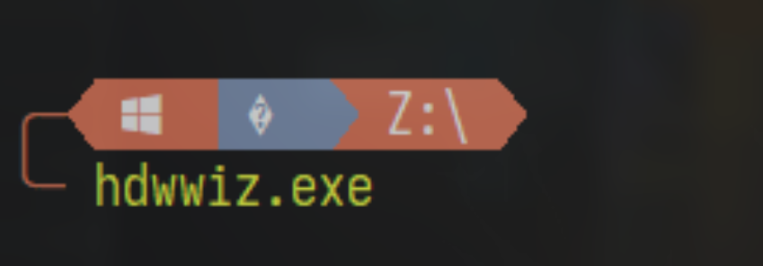 

3. Click `Next`
 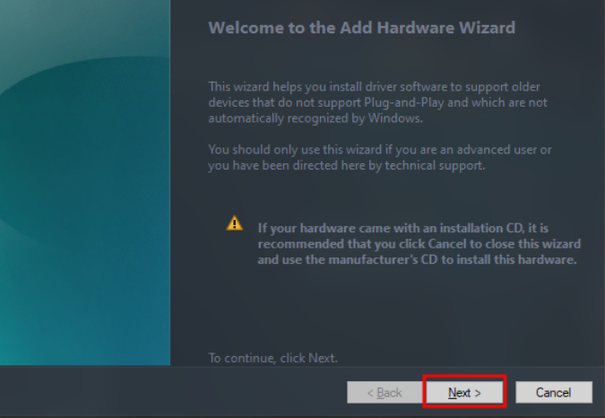 

4. Choose to install hardware manually then click `Next`
 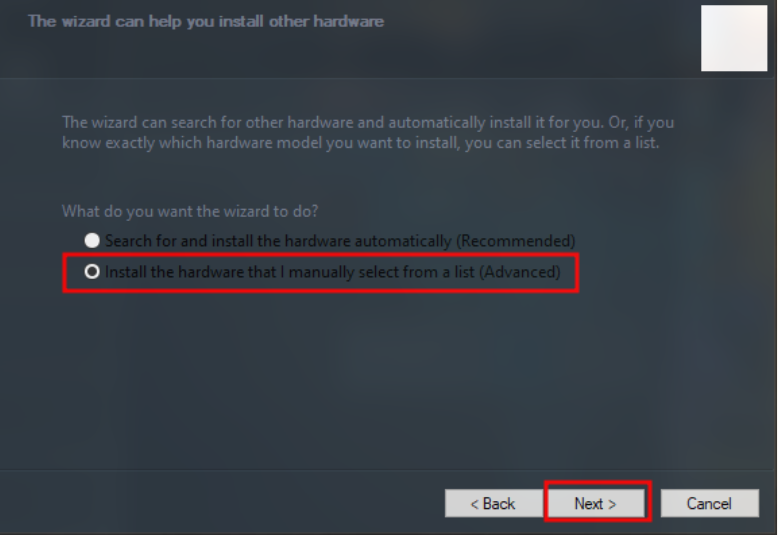 

5. Choose `Network adapters`, then click `Next`
 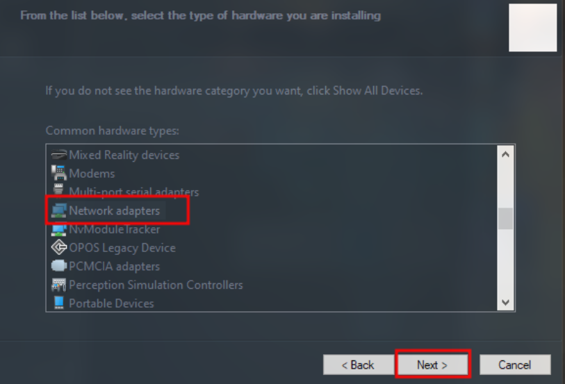 

6. Select `Microsoft` as the manufacturer, and choose the `KM-TEST Loopback Adapter`. Click Next twice to install the adapter and Finish.
 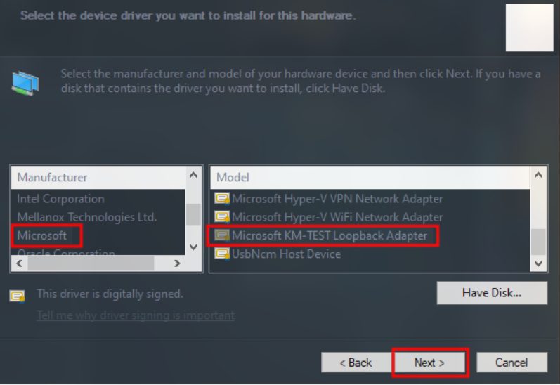 

7. Verify that the adapter is installed
>Start > Settings > Control Panel > Network and Sharing Center > Change Adapter Settings
 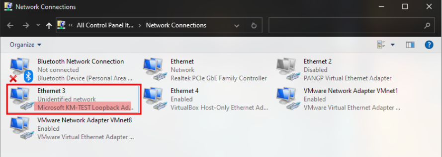 

### Loopback Adapter Configuration
1. Navigate to Network Adapters
>Start > Settings > Control Panel > Network and Sharing Center > Change Adapter Settings
2. Right click the loopback adapter
  

3. Select `Properties`
4. Find `Internet Protocol Version 4 (TCP/IPv4)`
5. Select `Properties`
 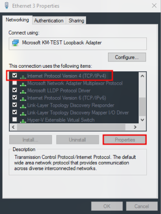 

6. Check `Use the following IP address`
7. Input an IP address and subnet mask
 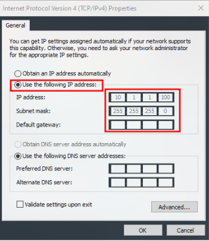 

8. Click `Ok` to confirm settings

## Application Configuration

### VMware Workstation Player Configuration

1. Open VMware Workstation Player
2. Import `GNS3 VM`
3. Open `GNS3 VM Settings` (ensure the VM is closed)
 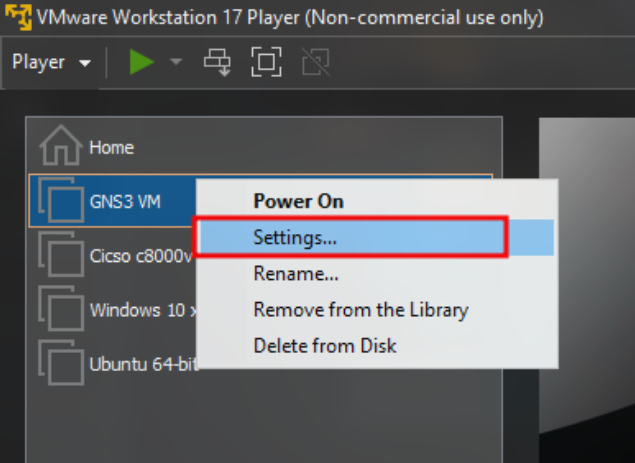 

4. Add a new hardware component and select `Network Adapter`
 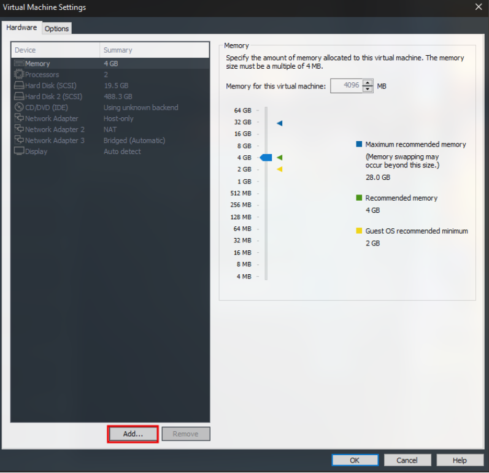 

5. Select `Network Adapter 3`, 
   1. set it to `Bridged` mode
   2. click `Configure Adapters`
  

6. Select the loopback adapter we created in the previous section
 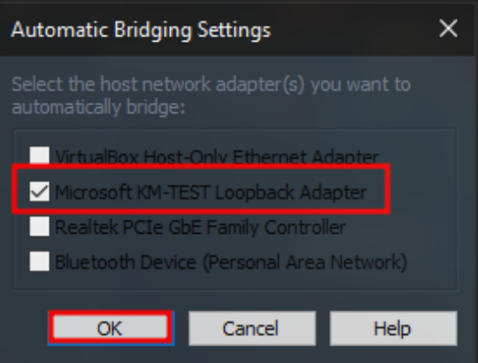 

7. Click `OK` to confirm all changes

